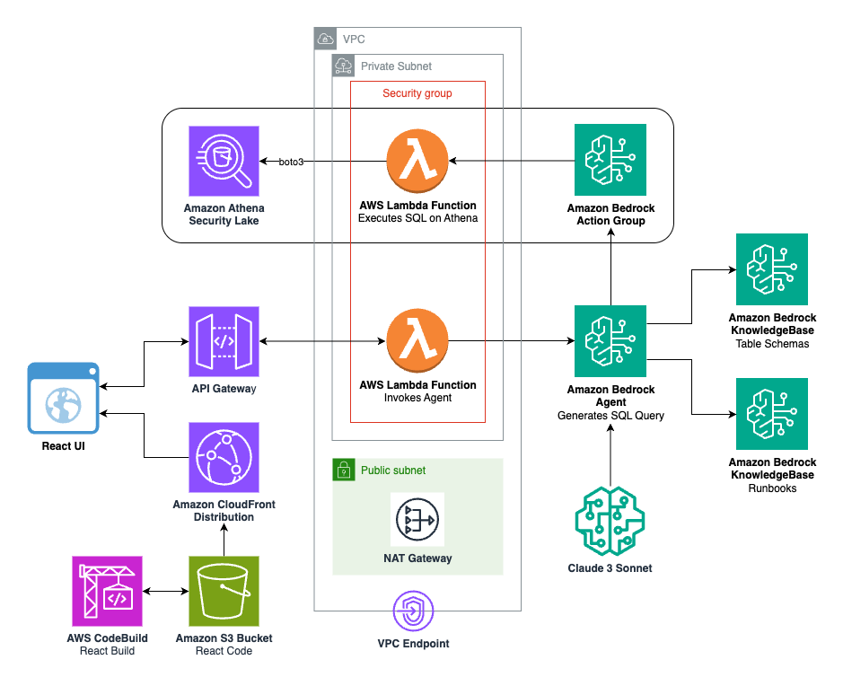

 # **Amazon Security Lake Generative AI with UI**
The project deploys an Amazon Bedrock Agent and it's foundational infrastructure frontend-ed by a React UI to query Amazon Security Lake. Once deployed, you can use the UI for use threat hunting and analysis with Amazon Security Lake.

By utilizing Bedrock's generative artificial intelligence capabilities to generate code and queries from natural language input, you will be able quickly utilize SageMaker's capabilities to explore and derive machine learning insights from your Security Lake data. By using all these AWS services together, you can identify different areas of interest to focus on and increase your overall security posture. 

## **Prerequisites**

1. [Enable Amazon Security Lake](https://docs.aws.amazon.com/security-lake/latest/userguide/getting-started.html). For multiple AWS accounts, it is recommended to manage [Security Lake for AWS Organizations](https://docs.aws.amazon.com/security-lake/latest/userguide/multi-account-management.html) To help automate and streamline the management of multiple accounts, we strongly recommend that you integrate Security Lake with AWS Organizations.
2. [Amazon Bedrock](https://docs.aws.amazon.com/bedrock/latest/userguide/setting-up.html) is available for use in the AWS account. Additionally, you need to [add model access for ClaudeV3-Sonnet](https://docs.aws.amazon.com/bedrock/latest/userguide/model-access.html#add-model-access). You will get an error message if you try to use a model before enabling it within your AWS account.
3. [Subcriber Query Access](https://docs.aws.amazon.com/security-lake/latest/userguide/subscriber-query-access.html): Subscribers with query access can query data that Security Lake collects. These subscribers directly query AWS Lake Formation tables in your S3 bucket with services like Amazon Athena.
4. Resource Linking: Create a Lake Formation database in AWS Subscriber account using resource linking
    - Go to Lake Formation in the Subscriber AWS account
    - Create a new database using resource linking
    - Enter Resource Link name
    - Enter Shared database name and shared database Owner ID and click create
  

## Architecture

## **Deploy Solution using CDK**

**Build**

To build this app, you need to be in the project root folder. Then run the following:

    $ npm install -g aws-cdk
    <installs AWS CDK>

    $ npm install
    <installs appropriate packages>

    $ cdk synth
    <build CDK and TypeScript files>

**Deploy**

    $ cdk bootstrap aws://<INSERT_AWS_ACCOUNT>/<INSERT_REGION>
    <build S3 bucket to store files to perform deployment>

    $ cdk deploy --all
    <deploys the CDK project into the authenticated AWS account. Deploys three CloudFormation stacks: "FrontendAppStack", "BedrockAppStack", "BedrockBaseInfraStack">

As part of the CDK deployment, there is an Output value for the React Application URL (FrontendAppStack.ReactAppUrl). You will use this value to interact with the GenAI application. Wait up to 5 mins for the URL to be live.

## **Post Deployment Steps**
**Access to Security Lake**

Now that you have deployed the solution, you will need to grant the Bedrock Agent's Lambda role in your AWS account access to query Security Lake from the AWS account it was enabled in. We will use the "Grant" permission to allow the Lambda role ARN to access Security Lake Database in Lake Formation within the Subscriber AWS account.

**Grant permission to Security Lake Database**
1. Copy the Lambda's role ARN from the "BedrockAppStack" CloudFormation stack. The resource in the stack is named as "athenaAgentSecurityLakeActionGroupLambdaServiceRole********".
2. Go to Lake Formation in console
3. Select the amazon_security_lake_glue_db_<YOUR-REGION>  database.
    1. For example, if your Security Lake is in us-east-1 the value would be amazon_security_lake_glue_db_us_east_1
4. From the Actions  Dropdown, select Grant.
5. In Grant Data  Permissions, select SAML Users and Groups.
6. Paste ARN from Step 1.
7. In Database  Permissions, select Describe and then Grant.
   

**Grant permissions to Security Lake table(s)**
1. Copy the Lambda's role ARN from the "BedrockAppStack" CloudFormation stack. The resource in the stack is named as "athenaAgentSecurityLakeActionGroupLambdaServiceRole********".
2. Go to Lake Formation in console
3. Select the amazon_security_lake_glue_db_<YOUR-REGION>  database.
    1. For example, if your Security Lake is in us-east-1 the value would be amazon_security_lake_glue_db_us_east_1
4. Choose View Tables.
5. Select the amazon_security_lake_table_<YOUR-REGION>_sh_findings_1_0  table.
    1. For example, if your Security Lake is in us-east-1 the value would be amazon_security_lake_table_us_east_1_sh_findings_1_0
    2. Note: Each table must be granted access individually. Selecting “All Tables“ will not grant the appropriate access needed to query Security Lake.
6. From Actions Dropdown, select Grant.
7. In Grant Data  Permissions, select SAML Users and Groups.
8. Paste ARN from Step 1.
9. In Table Permissions, select Describe and then Grant.
  

**Sync Data Sources**

*After the infrastructure has been deployed, the Data Sources in the Amazon Bedrock Knowledge Bases need to be synced so the data in S3 can be vectorized and made available in Amazon OpenSearch Serverless which is the service used as a Vector Source by the Bedrock Knowledge Bases in this solution.

1. Navigate to Knowledge Bases in Amazon Bedrock in the AWS management console and find the two Bedrock Knowledge Bases deployed in this solution gen-ai-sec-lake-table-schema, gen-ai-sec-lake-runbooks. Navigate to each Knowledge Base and their Data Sources. Then click sync for each data source.
  

**[OPTIONAL] Upload Data in S3 under prefixes**

There are two Amazon Bedrock Knowledge Bases created as part of this solution. To populate the Bedrock Knowledge Bases place, there are example files in an S3 bucket created as part of this solution, in their respective prefixes.
1. gen-ai-sec-lake-table-schema. Upload additional files that provide context for the Bedrock Agent to curate SQL queries to execute on the Security Lake. Place files that have schema for the tables under /table_schema, and files that have examples of SQL queries you expect the agent to create under /example_queries. Sync the Data Sources again.
2. gen-ai-sec-lake-runbooks. Upload additional files that provide runbooks for suggesting remediation of security findings. Placed them under /runbooks. Sync the Data Source again.
  

**Cleanup**

When you are finished with the solution, delete the CloudFormation stacks to delete the AWS resources that were deployed.

First, manually empty and delete the following S3 buckets from the console or AWS CLI:
- kb-source-s3-bucket*
- kb-source-s3-access-logs*

Next, delete the CloudFormation stacks:

    $ cdk destroy --all
    <deletes the three CloudFormation stacks: "FrontendAppStack", "BedrockAppStack", "BedrockBaseInfraStack">
